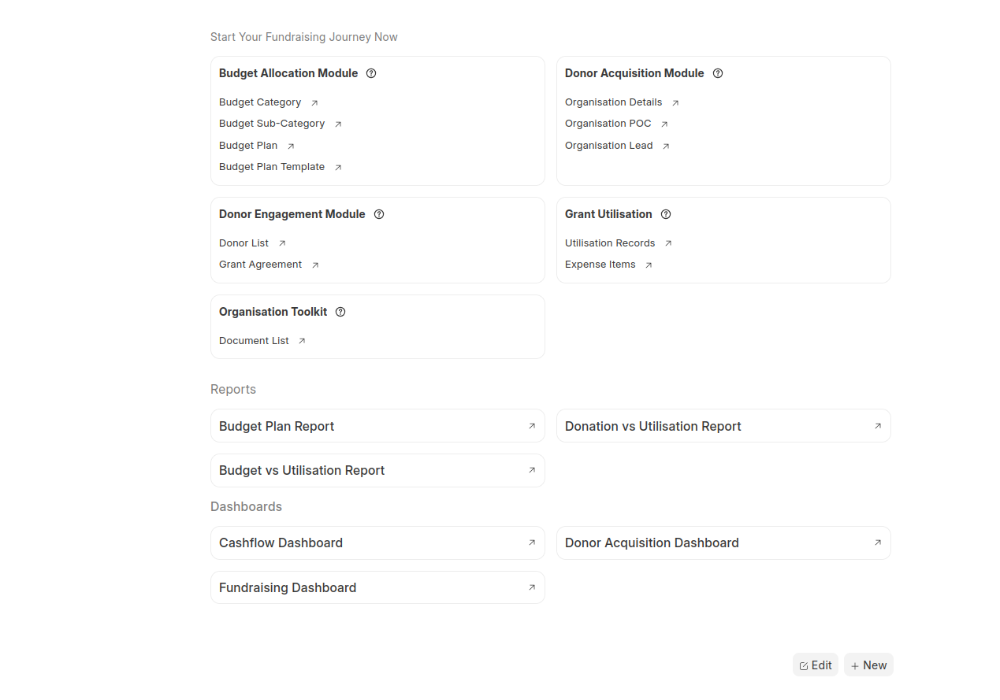
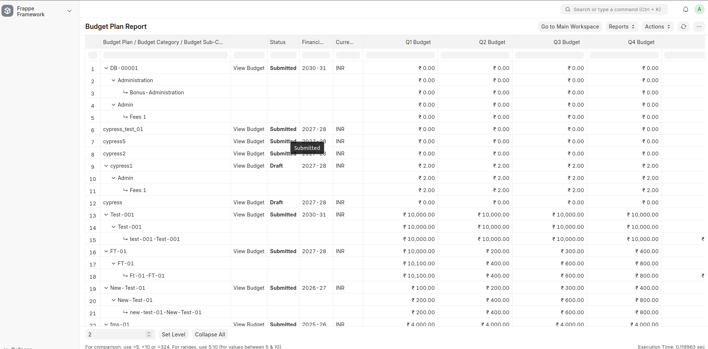

# Funder Management System

A comprehensive Frappe-based application designed to streamline funder and grant management operations, including budget planning, donor acquisition, engagement tracking, and financial utilization monitoring.


### Main Workspace


## Reports


## Features

- **Budget Planning & Management**
  - Create and manage budget plans with multi-level categorization
  - Track budget breakdown by category and sub-category
  - Manage budget tranches with financial tracking
  - Cashflow dashboard for real-time budget visibility
  - Budget plan templates for standardized planning

- **Donor & Funder Management**
  - Maintain comprehensive donor database
  - Track donor acquisition and lead management
  - Manage grant agreements and grant tranches
  - Monitor grant utilization and expenditure
  - Donor engagement tracking and history

- **Expense & Utilization Tracking**
  - Record and monitor expense items
  - Track utilization records with detailed breakdowns
  - Real-time budget vs. actual reporting
  - Financial year-based expense categorization

- **Permission & Role Management**
  - Domain-based access control
  - Customizable permission management system
  - Role-based access for different modules
  - Automated permission setup for new doctypes

- **Reporting & Analytics**
  - Budget plan reports with comprehensive views
  - Budget breakdown analysis
  - Donor acquisition metrics
  - Financial dashboards and number cards
  - Real-time expense tracking scenarios

- **Compliance & Administration**
  - Engagement checklist management
  - Compliance checklist tracking
  - Organization tools for administrative tasks
  - Module-level permission controls
  - Audit history for all transactions

## Installation

### Prerequisites

- [Frappe Bench](https://github.com/frappe/bench) (v15 or later)
- Python 3.10+
- Node.js 18+
- MariaDB 10.6+ or PostgreSQL 13+
- Redis (for caching and job queues)

### Frappe Bench Setup

For detailed instructions on setting up Frappe Bench, refer to the [Frappe Deployment Documentation](https://github.com/T4GC-Official/frappe-deployment-doc.git). This guide provides comprehensive setup instructions for various environments and deployment scenarios.

### Installation Steps

1. **Get the app**

```bash
cd $PATH_TO_YOUR_BENCH
bench get-app funder_management_system https://github.com/your-repo/funder-management-system.git --branch develop
```

2. **Install on your site**

```bash
bench --site $SITE_NAME install-app funder_management_system
```

3. **Run initial setup (optional)**

```bash
bench --site $SITE_NAME migrate
```

4. **Restart and rebuild**

```bash
bench build
bench restart
```

### Configuration

After installation, configure the following:

- Set up user roles and permissions
- Configure domain restrictions if needed
- Create financial years for budget planning
- Set up budget categories and templates
- Configure email notifications for alerts

### Setup for Development

Install development dependencies:

```bash
cd apps/funder_management_system
pip install -e .
```

## Contributing

### Development Setup

This app uses `pre-commit` for code formatting and linting. Please [install pre-commit](https://pre-commit.com/#installation) and enable it for this repository:

```bash
cd apps/funder_management_system
pre-commit install
```

### Running Tests

To run tests locally:

```bash
bench --site $SITE_NAME run-tests --app funder_management_system
```

### Code Standards

- Follow [Frappe Coding Standards](https://frappe.io/docs/user/en/guides/app-development/python-code-style)
- Ensure all tests pass before submitting a PR
- Include docstrings for new functions and classes
- Keep commits atomic and descriptive


## Support

For issues, feature requests, or contributions, please refer to the [project repository](https://github.com/your-repo/funder-management-system).

## License

This project is licensed under the GNU AFFERO GENERAL PUBLIC LICENSE Version 3. See [LICENSE.txt](license.txt) for details.
